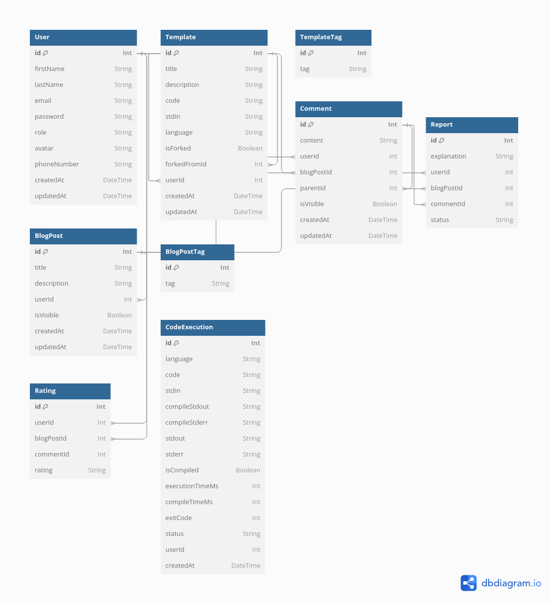

# Setup Script for Project

## Overview

This script automates the setup process for the server environment of the project. It checks for necessary dependencies, sets up the environment configuration, installs required packages, and prepares the database.

## Prerequisites

Before running the script, ensure you have the following installed on your system:

- **Node.js**: You can download it from [nodejs.org](https://nodejs.org/en/download/).
- **npm**: npm comes bundled with Node.js, but you can also install it separately if needed.

## Usage

To use the setup script, follow these steps:

1. **Run the Setup Script**:

   Execute the script using the following command:

   ```bash
   ./setup.sh

   # or with database reset

   RESET_DB=true ./setup.sh
   ```

   This script performs the following actions:

   - Checks for the existence of Node.js and npm, and prompts for installation if they are missing.
   - Checks for Prisma installation and installs it if not present.
   - Resets the database if the `RESET_DB` environment variable is set to `true`.
   - Installs the required npm packages.
   - Runs Prisma migrations to ensure the database schema is up to date.
   - Creates an admin user using the `createAdmin.js` script.

2. **Start the Server**:

   After running the setup script, you can start your server with:

   ```bash
   ./run.sh
   ```

## Test Admin Account

- **Email**: admin@example.com
- **Password**: LeFlop23

## API Documentation

The API documentation is created with the OpenAPI schema with the version 3.0.0, a PDF version is attached below and the interactive version can be found at http://localhost:3000/api-docs

## Running the Server on CS Teaching Labs

- Start the server on the CS Teaching Labs
- Run the following command on your local machine

```bash
ssh -L 3000:localhost:3000 username@teach.cs.utoronto.ca
```

- Access the server at http://localhost:3000

## Deployment

Find the deployment at https://csc309-demo.davidzyl.in/

## Find Docker Endpoint

In order to find the docker endpoint, you can run the following command:

```bash
docker context ls
```

And then you can set the enviromental variable `DOCKER_DAEMON_SOCKET` to the endpoint of the docker daemon.

## Database Schema

1. **User**

   - **Fields**:

     - `id` (Int, Primary Key, Auto-increment): Unique identifier for each user.
     - `firstName` (String): First name of the user.
     - `lastName` (String): Last name of the user.
     - `email` (String, Unique): User's email address.
     - `password` (String): Password for user authentication.
     - `role` (String, Default: "user"): Role assigned to the user (e.g., "user" or "admin").
     - `avatar` (String, Nullable): URL to the user's avatar image.
     - `phoneNumber` (String, Nullable): Contact phone number of the user.
     - `createdAt` (DateTime, Default: Current timestamp): When the user account was created.
     - `updatedAt` (DateTime, Default: Auto-update on change): Timestamp of the last update.

   - **Relationships**:
     - **One-to-Many** with `Template`, `BlogPost`, `Comment`, `Report`, `Rating`, and `CodeExecution`.

---

2. **Template**

   - **Fields**:

     - `id` (Int, Primary Key, Auto-increment): Unique identifier for each template.
     - `title` (String): Title of the template.
     - `description` (String): Detailed description of the template.
     - `code` (String): The actual code in the template.
     - `stdin` (String, Nullable): Standard input for code execution, if applicable.
     - `language` (String): Programming language of the template.
     - `isForked` (Boolean): Flag indicating if the template is a fork of another.
     - `forkedFromId` (Int, Nullable): ID of the parent template if this is a fork.
     - `userId` (Int): ID of the user who created the template.
     - `createdAt` (DateTime, Default: Current timestamp): Creation time of the template.
     - `updatedAt` (DateTime, Default: Auto-update on change): Timestamp of the last update.

   - **Relationships**:
     - **Many-to-One** with `User` (template creator).
     - **Self-Referencing One-to-Many** for forking relationships.
     - **Many-to-Many** with `TemplateTag` (tags on templates).

---

3. **TemplateTag**

   - **Fields**:

     - `id` (Int, Primary Key, Auto-increment): Unique identifier for each tag.
     - `tag` (String, Unique): Tag name associated with templates.

   - **Relationships**:
     - **Many-to-Many** with `Template`.

---

4. **BlogPost**

   - **Fields**:

     - `id` (Int, Primary Key, Auto-increment): Unique identifier for each blog post.
     - `title` (String): Title of the blog post.
     - `description` (String): Content or description of the blog post.
     - `userId` (Int): ID of the user who created the blog post.
     - `isVisible` (Boolean, Default: true): Flag indicating if the blog post is publicly visible.
     - `createdAt` (DateTime, Default: Current timestamp): Creation time of the blog post.
     - `updatedAt` (DateTime, Default: Auto-update on change): Timestamp of the last update.

   - **Relationships**:
     - **Many-to-One** with `User`.
     - **Many-to-Many** with `BlogPostTag`.
     - **One-to-Many** with `Comment`, `Report`, and `Rating`.

---

5. **BlogPostTag**

   - **Fields**:

     - `id` (Int, Primary Key, Auto-increment): Unique identifier for each blog post tag.
     - `tag` (String, Unique): Tag name for categorizing blog posts.

   - **Relationships**:
     - **Many-to-Many** with `BlogPost`.

---

6. **Comment**

   - **Fields**:

     - `id` (Int, Primary Key, Auto-increment): Unique identifier for each comment.
     - `content` (String): Text content of the comment.
     - `userId` (Int): ID of the user who made the comment.
     - `blogPostId` (Int): ID of the blog post this comment is associated with.
     - `parentId` (Int, Nullable): ID of the parent comment for nested replies.
     - `isVisible` (Boolean, Default: true): Visibility flag for the comment.
     - `createdAt` (DateTime, Default: Current timestamp): Creation time of the comment.
     - `updatedAt` (DateTime, Default: Auto-update on change): Timestamp of the last update.

   - **Relationships**:
     - **Many-to-One** with `User` and `BlogPost`.
     - **Self-Referencing One-to-Many** for replies within comments.
     - **One-to-Many** with `Rating` and `Report`.

---

7. **Report**

   - **Fields**:

     - `id` (Int, Primary Key, Auto-increment): Unique identifier for each report.
     - `explanation` (String): Explanation or reason for reporting the content.
     - `userId` (Int): ID of the user who submitted the report.
     - `blogPostId` (Int, Nullable): ID of the blog post being reported (if applicable).
     - `commentId` (Int, Nullable): ID of the comment being reported (if applicable).
     - `status` (String, Default: "open"): Status of the report.

   - **Relationships**:
     - **Many-to-One** with `User`, `BlogPost`, and `Comment`.

---

8. **Rating**

   - **Fields**:

     - `id` (Int, Primary Key, Auto-increment): Unique identifier for each rating.
     - `userId` (Int): ID of the user who gave the rating.
     - `blogPostId` (Int, Nullable): ID of the rated blog post (if applicable).
     - `commentId` (Int, Nullable): ID of the rated comment (if applicable).
     - `rating` (String): Type of rating, such as "+1" or "-1".

   - **Relationships**:
     - **Many-to-One** with `User`, `BlogPost`, and `Comment`.

---

9. **CodeExecution**

   - **Fields**:

     - `id` (Int, Primary Key, Auto-increment): Unique identifier for each code execution.
     - `language` (String): Programming language of the code.
     - `code` (String): Code being executed.
     - `stdin` (String, Nullable): Input to the code, if applicable.
     - `isCompiled` (Boolean): Flag indicating if the code is compiled.
     - `compileStdout` (String, Nullable): Output of the compilation process.
     - `compileStderr` (String, Nullable): Error output from compilation.
     - `stdout` (String, Nullable): Standard output from code execution.
     - `stderr` (String, Nullable): Error output from code execution.
     - `executionTimeMs` (Int, Nullable): Time taken for execution in milliseconds.
     - `compileTimeMs` (Int, Nullable): Time taken for compilation in milliseconds.
     - `exitCode` (Int, Nullable): Exit code from the code execution.
     - `status` (String, Default: "pending"): Current status of the code execution.
     - `userId` (Int, Nullable): ID of the user who executed the code.
     - `createdAt` (DateTime, Default: Current timestamp): Creation time of the code execution.

   - **Relationships**:
     - **Many-to-One** with `User`.


